OOPS

Design principles: SOLID, (DRY, KISS)

UML Diagrams

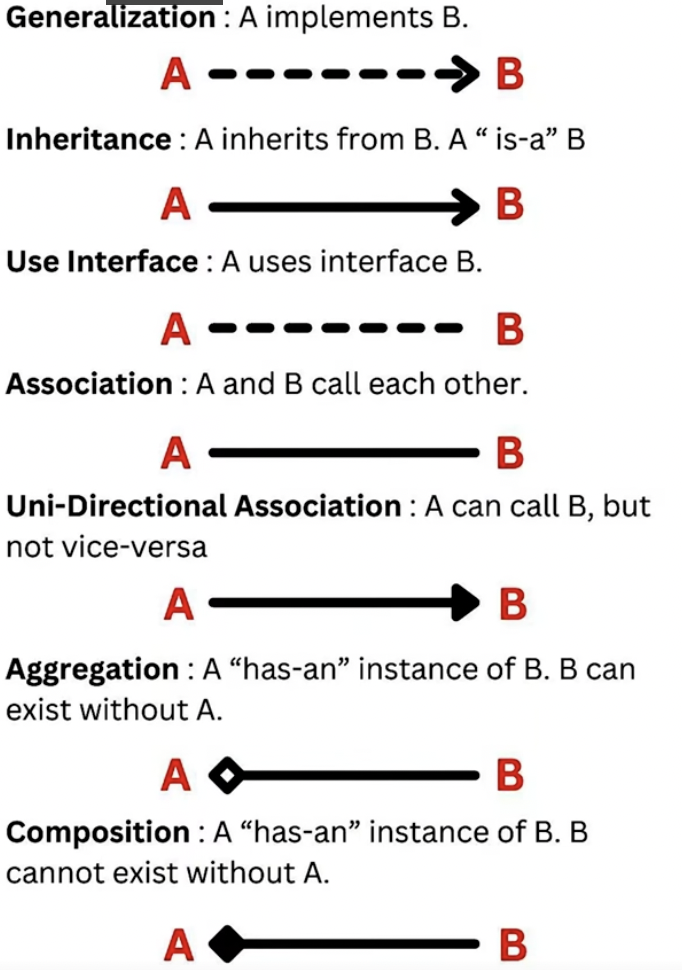
Design patterns:

Creational
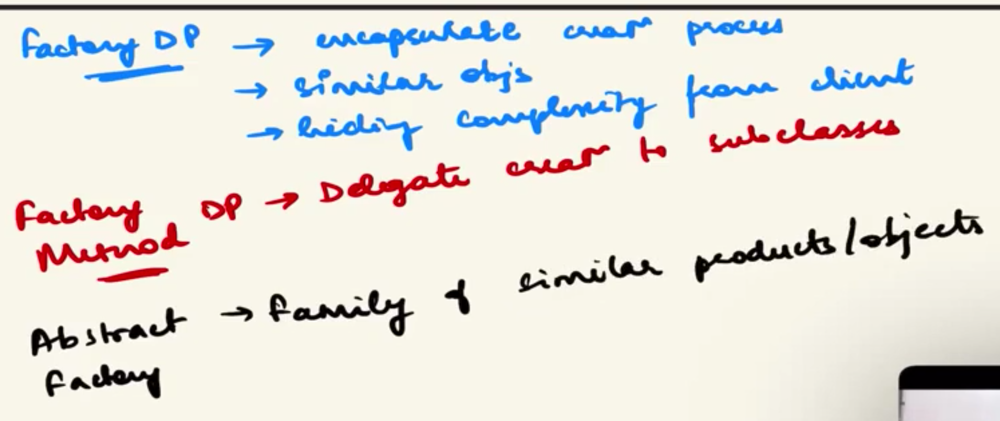
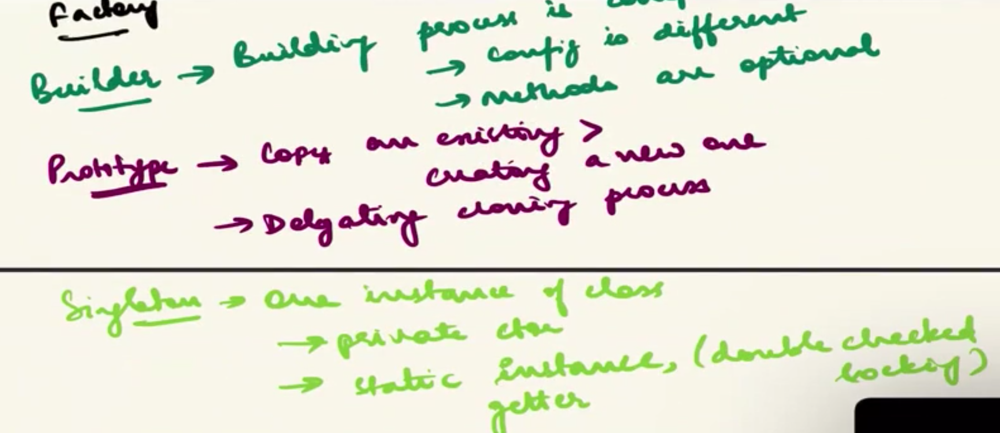

(Simple) Factory pattern: One Factory containing create() method with if-else statements. Client passes type as arg in method.

**one factory creates objects using if/else**

```java
main
→ LoggerFactory logger = LoggerFactory.createLogger("DEBUG")
→ Factory: if(type == "INFO") new InfoLogger()
           if(type == "DEBUG") new DebugLogger()
           if(type == "ERROR") new ErrorLogger()
→ return ILogger
→ main calls logger.log("message")
```

Factory method pattern:

Interface factory containing create() method, all Factories will implement this method. Client chooses which factory to be created.

**subclasses decide which object**

```java
main
→ ILoggerFactory factory = new DebugLoggerFactory()
→ factory.createLogger()
→ DebugLoggerFactory: return new DebugLogger()
→ return ILogger
→ main calls logger.log("message")
```

Abstract Factory pattern:

Factory interface containing multiple create() methods for each object variant. All factories implement all these methods to create families of objects of a specific variant. Client chooses which factory to instantiate.

**factory creates families of related objects by using multiple create methods**

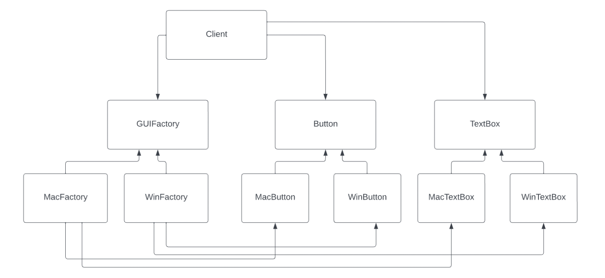

```java
main
→ IGUIFactory factory = new MacFactory() / WindowsFactory()
→ factory.createButton()
→ MacFactory: return new MacButton()
→ return IButton
→ main calls button.render()

→ factory.createText()
→ MacFactory: return new MacText()
→ return IText
→ main calls text.render()
```

Builder pattern:
```java
Class: House, 
Builder: IHouseBuilder, 
Director: Civil Engineer buildHouse(IHousebuilder)
```
Step-by-step methods to set *parts* of an object.
Concrete builders implement these steps for each variants.
An optional (can be client itself) Director controls the how to use the builder to set fields and returns the constructed product.

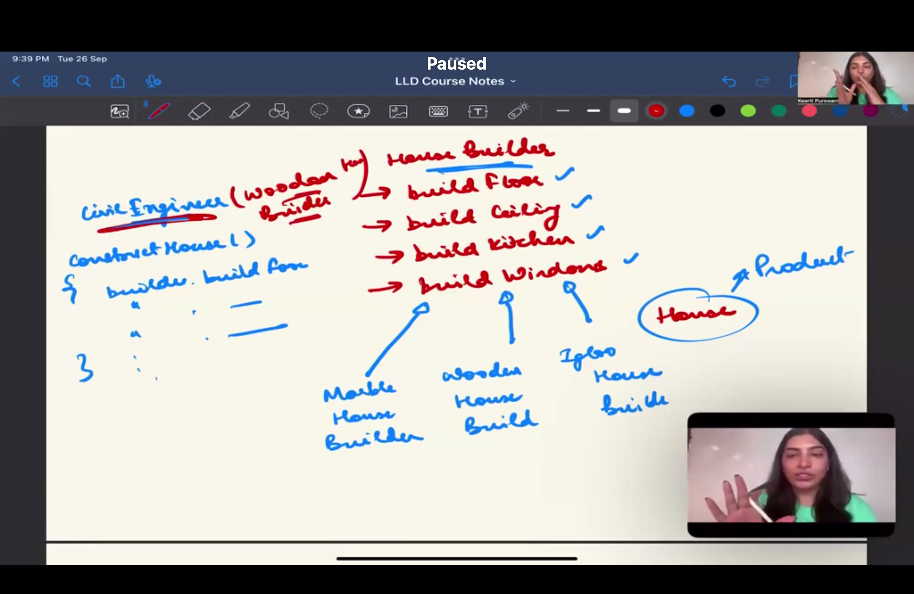

It is mostly useful for

1. languages not supporting named params:
   `Pizza myPizza = new Pizza("Large", null, null, true, false, null, "Stuffed");`
   What does true mean? What does false mean? Why are there so many nulls? The Builder pattern fixes this by making it readable:

`Pizza myPizza = new PizzaBuilder().setSize("Large").addCheese().hasStuffedCrust().build();`

2. When you don't get all params at the same time
   Sometimes you don't have all the parameters at the exact same time.
   Maybe you get the size of the pizza from screen 1 of your app.
   You get the toppings from screen 2.
   You get the crustType from screen 3.

- With a constructor, you'd have to save those variables somewhere temporarily until you reach screen 3.
- With a Builder, you can just pass the PizzaBuilder object from screen to screen, adding data as you go, and call .build() at the very end.

```java
main
→ IDesktopBuilder builder = new DellDesktopBuilder() / HpDesktopBuilder()

→ Director director = new Director(builder)
→ Desktop desktop = director.buildDesktop()

→ Director:
     builder.buildMotherboard()
     builder.buildProcessor()
     builder.buildMemory()
     builder.buildStorage()
     builder.buildGraphicsCard()
     return builder.getDesktop()

→ DellDesktopBuilder: sets Dell-specific components
→ return Desktop
→ main uses desktop
```

For **Builder pattern**, both **interface** and **abstract class** are used depending on whether you want **shared implementation**.

### IDesktopBuilder (Interface)

Use when builders only define **contract**, no shared logic.

```java
public interface IDesktopBuilder {
    IDesktopBuilder setMotherboard(String motherboard);
    IDesktopBuilder setProcessor(String processor);
    IDesktopBuilder setMemory(String memory);
    IDesktopBuilder setStorage(String storage);
    IDesktopBuilder setGraphicsCard(String graphicsCard);
    Desktop build();
}
```

**Use when:**

- Builders are **very different implementations**
- No common code between builders

---

### ADesktopBuilder (Abstract Class)

Use when builders share **common fields or partial implementation**.

```java
public abstract class ADesktopBuilder {
    protected Desktop desktop = new Desktop();

    public ADesktopBuilder setMotherboard(String motherboard) {
        desktop.setMotherboard(motherboard);
        return this;
    }

    public ADesktopBuilder setProcessor(String processor) {
        desktop.setProcessor(processor);
        return this;
    }

    public abstract Desktop build();
}
```

**Use when:**

- Builders share **common state**
- Some steps are **same for all builders**


Prototype Pattern:

Used for creating new objects by cloning an existing prototype instead of instantiating from scratch.
Each prototype implements a clone() method.

```java
main
→ INetworkDevice routerPrototype = new Router()
→ INetworkDevice switchPrototype = new Switch()

→ INetworkDevice router1 = routerPrototype.clone()
→ INetworkDevice switch1 = switchPrototype.clone()

→ Router.clone(): return new Router(copy fields) //ENSURE TYPE OF COPY WHILE COPYING - SHALLOW OR DEEP (YOUR CHOICE,  HAVE TO HANDLE IN CLONE)
→ Switch.clone(): return new Switch(copy fields)

→ main uses router1 / switch1
```

```java
//DEEP COPY IMPL. EXAMPLE
class Router implements INetworkDevice {

    private Configuration config;

    @Override
    public Router clone() {
        Router clone = new Router();
        clone.config = config.clone(); // deep copy
        return clone;
    }
}
```

Singlton Pattern:

Ensure only one instance of a class exists and provide a global access point to it.

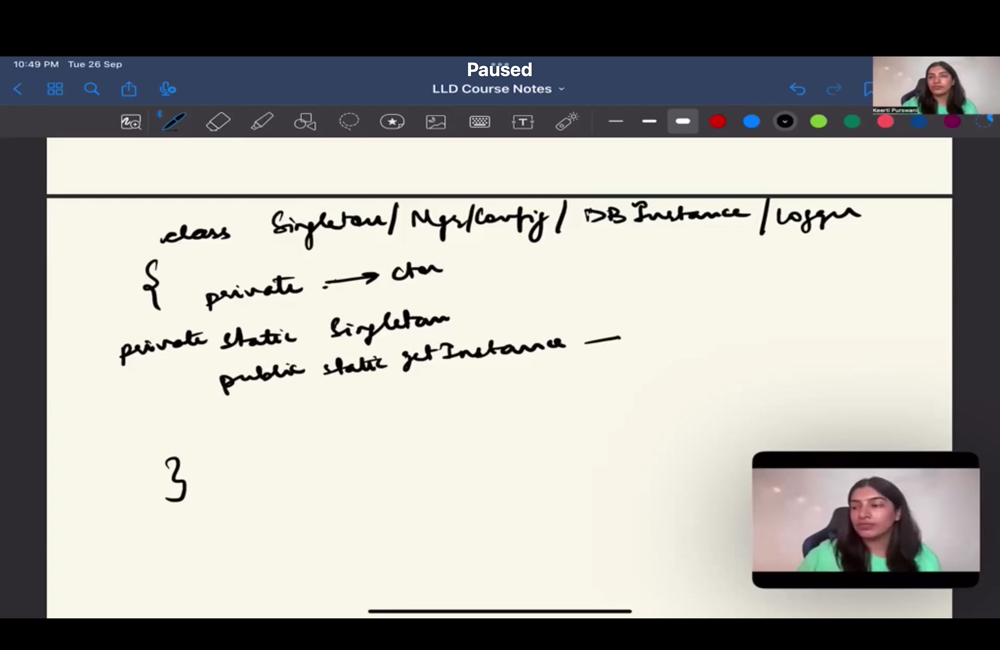

1. Eager Initialization

Instance created at class loading time.

```java
main
→ PaymentGatewayManager manager = PaymentGatewayManager.getInstance()
→ main calls manager.processPayment()
→ //(instance already created during class loading, return instance)

```

```java
public class PaymentGatewayManager {

    private static final PaymentGatewayManager INSTANCE = new PaymentGatewayManager();

    private PaymentGatewayManager() {}

    public static PaymentGatewayManager getInstance() {
        return INSTANCE;
    }
}
```

1. Lazy Initialization (+ with Double checked locking)

Instance created only when first requested (+ with thread safety).
Race condition can occurr when multiple threads are involved, so add a lock-unlock statement.
but,it is also costly, so call can be optimized by first checking whether instance is null, if it is only then use a lock. this way, lock is created only once.
Keep in mind, both checks are required,

- Check 1: Skips the expensive lock if the object is already built.
- Check 2: Ensures that a thread that was waiting in line for the lock doesn't accidentally build a duplicate object once it finally gets inside.

(if T1 & T2 both were waiting outside lock, when T1 starts first, finishes and goes out of unlock, T2 will start, but if second check was not there, T2 would create it again)
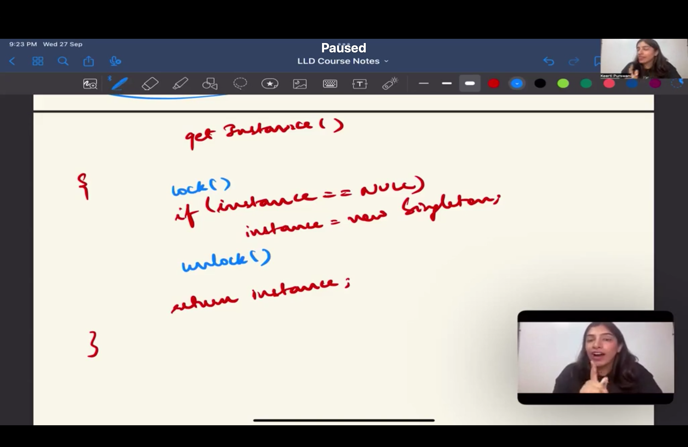 => 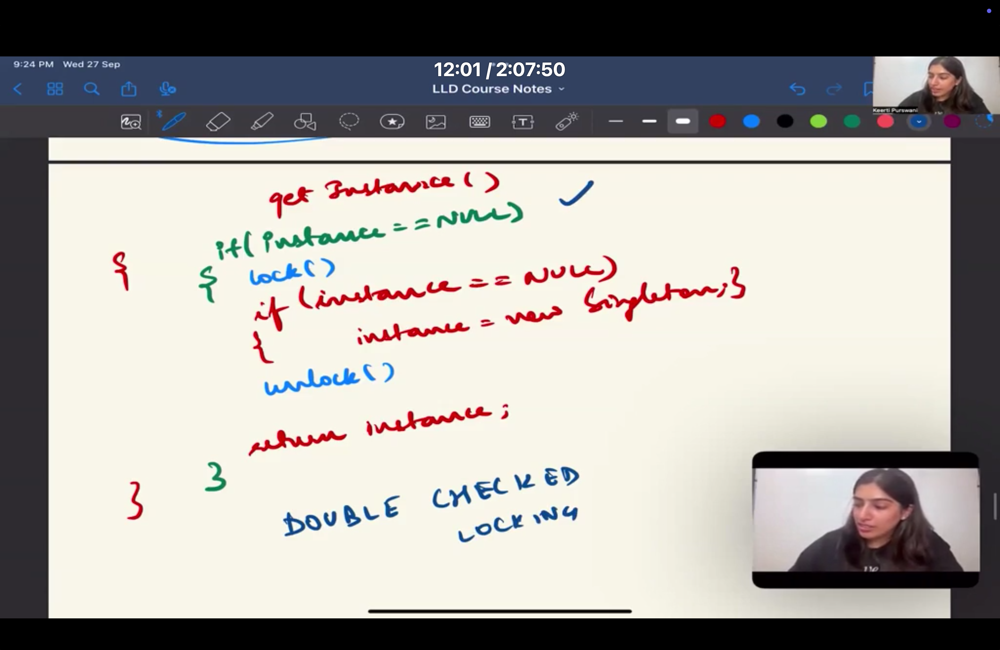

```java
main
→ PaymentGatewayManager manager = PaymentGatewayManager.getInstance()

→ if(instance == null)
      synchronized(PaymentGatewayManager.class)
           if(instance == null)
                instance = new PaymentGatewayManager()

→ return instance
→ main calls manager.processPayment()
```

Behavioral Patterns

Observer Pattern
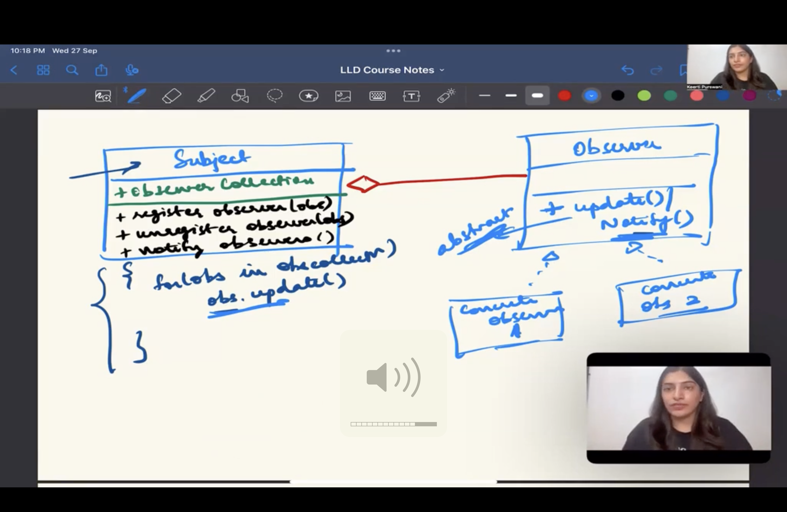
Subject maintains a list of observers. Observers register/subscribe to the subject and are notified automatically when the subject state changes.

``` java
        // Create an order
        Order order1 = new Order(123);

        // Create customers, restaurants, drivers, and a call center to track the order
        Customer customer1 = new Customer("Customer 1");
        Restaurant restaurant1 = new Restaurant("Rest 1");
        DeliveryDriver driver1 = new DeliveryDriver("Driver 1");
        CallCenter callCenter = new CallCenter();

        // Attach observers to the order
        order1.attach(customer1);
        order1.attach(restaurant1);
        order1.attach(driver1);
        order1.attach(callCenter);

        // Simulate order status updates
        order1.setStatus("Out for Delivery");

        // Detach an observer (if needed)
        order1.detach(callCenter);

        // Simulate more order status updates
        order1.setStatus("Delivered");
```

Command Pattern

Invoker triggers (can be client itself) → Concrete Command executes → Receiver performs work.

``` java
Client
   │
   │ creates
   ▼
Command Object
(RideRequestCommand)
   │
   │ passed to
   ▼
Invoker
(RideRequestInvoker)
   │
   │ execute()
   ▼
Command.execute()
   │
   ▼
Receiver
(RideService)
```
| Component             | In Your Code                              | Responsibility               |
| --------------------- | ----------------------------------------- | ---------------------------- |
| **Receiver**          | `RideService`                             | Actually performs the work   |
| **Command Interface** | `Command`                                 | Declares `execute()`         |
| **Concrete Commands** | `RideRequestCommand`, `CancelRideCommand` | Bind a request to a receiver |
| **Invoker**           | `RideRequestInvoker`                      | Triggers command execution   |
| **Client**            | `UberRidesDemo`                           | Creates and wires everything |

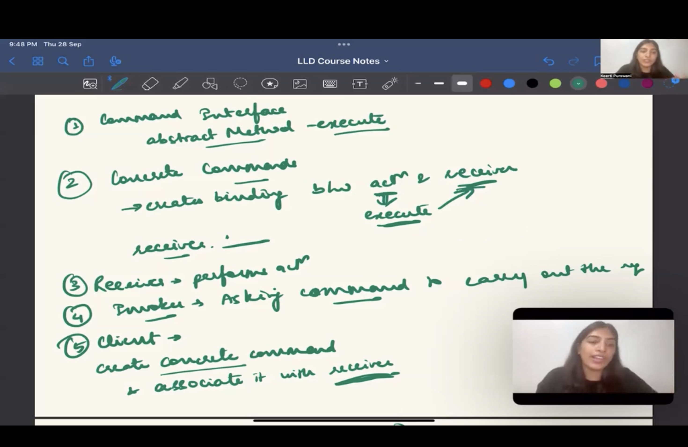

Chain of Responsibilty:

Use when multiple handlers can process a request and you want to decouple sender from receiver while allowing dynamic chaining.
"Try A → else B → else C"

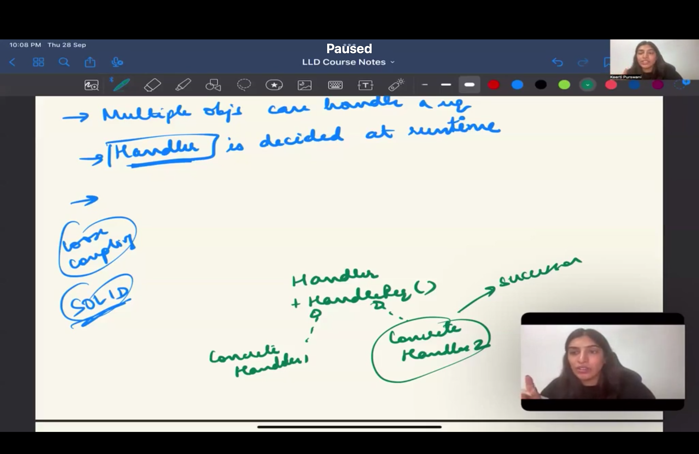


``` java
Constructor chaining → each handler gets next in constructor → forwards using nextHandler
``` 

``` java
main
→ OrderHandler chain =
     new OrderValidationHandler(
       new PaymentProcessingHandler(
         new OrderPreparationHandler(
           new DeliveryAssignmentHandler(
             new OrderTrackingHandler(null)))))

→ chain.processOrder("Pizza")

→ OrderValidationHandler.processOrder()
→ validates → calls next

→ PaymentProcessingHandler.processOrder()
→ processes payment → calls next

→ OrderPreparationHandler.processOrder()
→ prepares order → calls next

→ DeliveryAssignmentHandler.processOrder()
→ assigns delivery → calls next

→ OrderTrackingHandler.processOrder()
→ tracks order → end
```


Iterator Design Pattern:

Provides a way to traverse a collection

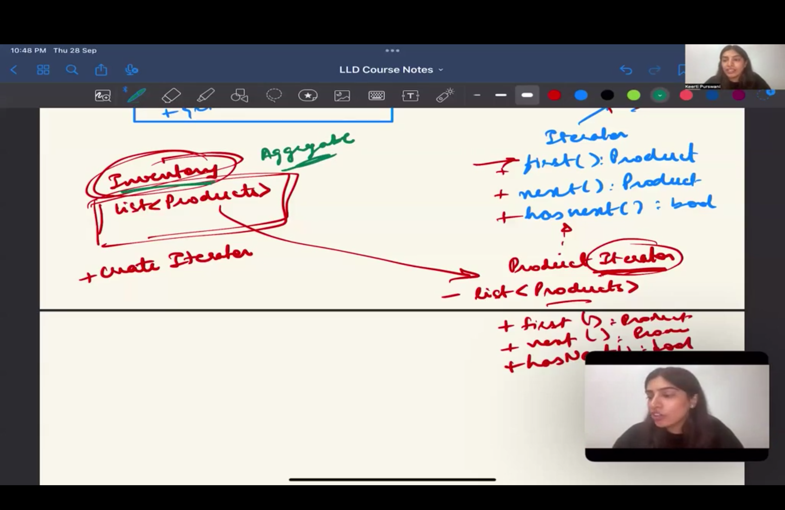


```java
-> Inventory (Aggregate): containing list of products => addProduct(), createIterator()

-> Iterator interface: having 
1. first(), 
2. next(), 
3. hasNext()

-> Concrete Iterator: having this list of products passed from Aggregate and some pointer variables like current
```

