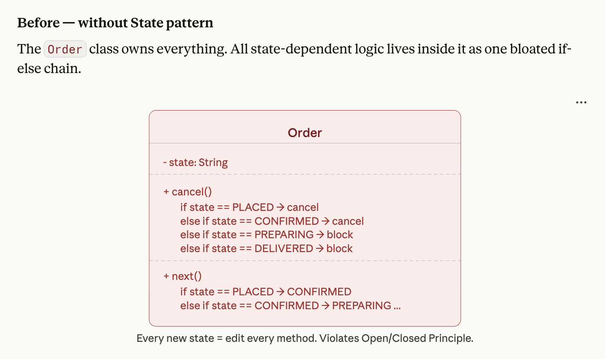
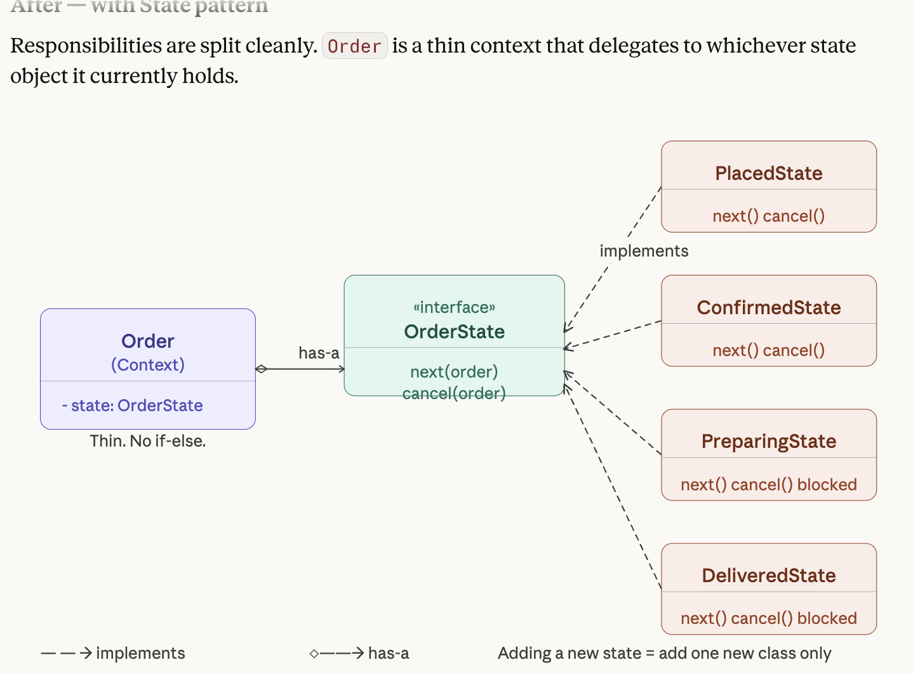
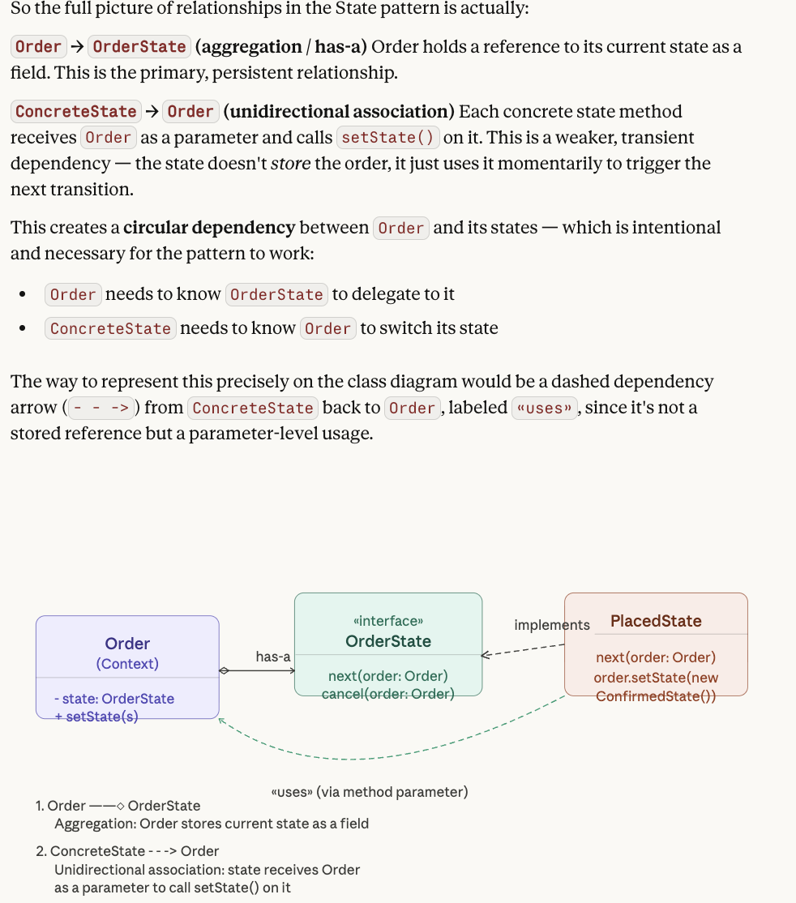
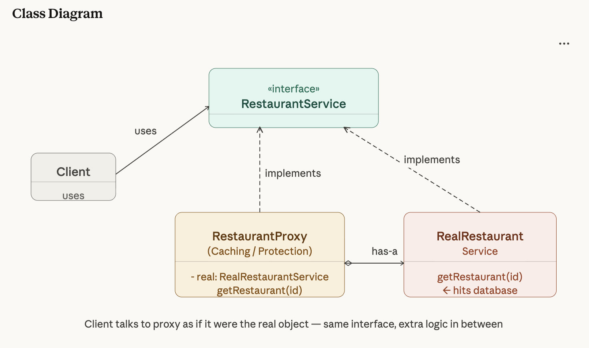

OOPS

## Design principles: SOLID, (DRY, KISS)

## UML Diagrams
- For agg vs composition, think what if i delete the parent class, does it make sense for the other to exist?

- [Class Diagram Cheatsheet](https://www.geeksforgeeks.org/system-design/unified-modeling-language-uml-class-diagrams/)

- 

## Design patterns:

Behavioral Design Patterns (7):

1. Chain of Responsibility
2. Command
3. Iterator
4. Observer
5. State
6. Strategy
7. Template

Structural Design Patterns (6):

8. Adapter
9. Bridge
10. Composite
11. Decorator
12. Facade
13. Proxy

Creational Design Patterns (6):

14. Simple Factory
15. Factory Method
16. Abstract Factory
17. Builder
18. Prototype
19. Singleton

---

## PART 1: CREATIONAL DESIGN PATTERNS


---

### 1. Simple Factory Design Pattern

**Intuition:**
It consolidates object creation into one place.

A Simple Factory is a single class with a method (usually static) that creates and returns different types of objects based on a given input parameter (like a **if-else or switch** case).
**Flow of Implementation:**

- **Product Interface (`ILogger`)**: Defines standard behavior.
- **Concrete Products (`DebugLogger`, `InfoLogger`, `ErrorLogger`)**: Implementing classes.
- **Simple Factory Class (`LoggerFactory`)**: Contains the `createLogger(LogLevel)` method with conditional logic (`switch` statement) to return the correct concrete object.
- **Client (`Main`)**: Uses the Simple Factory and passes in a parameter (`LogLevel`) to get an instance.

**Code (Consolidated):**

```java
package logger;

public interface ILogger { void log(String msg); }

class DebugLogger implements ILogger {
    public void log(String msg) { System.out.println("DEBUG : " + msg); }
}
class InfoLogger implements ILogger {
    public void log(String msg) { System.out.println("INFO : " + msg); }
}
class ErrorLogger implements ILogger {
    public void log(String msg) { System.out.println("ERROR : " + msg); }
}

enum LogLevel { DEBUG, INFO, ERROR }

class LoggerFactory {
    public static ILogger createLogger(LogLevel logLevel) {
        switch(logLevel) {
            case DEBUG: return new DebugLogger();
            case INFO:  return new InfoLogger();
            case ERROR: return new ErrorLogger();
            default:    return null;
        }
    }
}

public class Main {
    public static void main(String[] args) {
        ILogger debugLogger = LoggerFactory.createLogger(LogLevel.DEBUG);
        ILogger infoLogger = LoggerFactory.createLogger(LogLevel.INFO);
        ILogger errorLogger = LoggerFactory.createLogger(LogLevel.ERROR);

        debugLogger.log("This is a debug log msg");
        infoLogger.log("This is an info log msg");
        errorLogger.log("This is an error log msg");
    }
}
```

**Respecting SOLID Principles:**

- **SRP**: The client (`Main`) no longer handles object instantiation.
- _Note on OCP_: Simple Factory often inherently _violates_ the Open/Closed Principle, because if you add a new logger type, you are forced to modify the `LoggerFactory`'s `switch` statement. (This is why the **Factory Method** pattern is generally preferred over it in larger systems).

---

### 2. Factory Method Design Pattern

**Intuition:**
The Factory Method defines an **interface** for creating a single object, but **delegates** the exact instantiation logic to **subclasses**.

Instead of using a direct constructor (`new Object()`), the client calls a factory method which returns the instance.

**Flow of Implementation:**

- **Product Interface (`ILogger`)**: Defines the standard behavior of the object (`log()`).
- **Concrete Products (`DebugLogger`, `ErrorLogger`, `InfoLogger`)**: Different implementations of the interface.
- **Creator Interface (`LoggerFactory`)**: Declares the factory method (`createLogger()`).
- **Concrete Creators (`DebugLoggerFactory`, `ErrorLoggerFactory`, `InfoLoggerFactory`)**: Implement the factory method to return the corresponding concrete product instance.

**Code:**

```java
interface ILogger {
    void log(String msg);
}

class DebugLogger implements ILogger {
    public void log(String msg) { System.out.println("DEBUG : " + msg); }
}

class ErrorLogger implements ILogger {
    public void log(String msg) { System.out.println("ERROR : " + msg); }
}

class InfoLogger implements ILogger {
    public void log(String msg) { System.out.println("INFO : " + msg); }
}

interface LoggerFactory {
    ILogger createLogger();
}

class DebugLoggerFactory implements LoggerFactory {
    public ILogger createLogger() { return new DebugLogger(); }
}

class ErrorLoggerFactory implements LoggerFactory {
    public ILogger createLogger() { return new ErrorLogger(); }
}

class InfoLoggerFactory implements LoggerFactory {
    public ILogger createLogger() { return new InfoLogger(); }
}

public class LoggerDemo {
    public static void main(String[] args) {
        LoggerFactory loggerFactory = new InfoLoggerFactory();
        ILogger logger = loggerFactory.createLogger();

        logger.log("This is an info log message");
    }
}
```

**Respecting SOLID Principles:**

- **SRP**: The object creation logic is placed securely in a dedicated factory layer.
- **OCP**: You can introduce new loggers (`WarningLogger`) by creating a new `WarningLoggerFactory` without modifying any existing factory or client code.

---

### 3. Abstract Factory Design Pattern

**Intuition:**
The Abstract Factory pattern provides a factory interface containing multiple create() methods for each object variant.

All factories implement all these methods to create families of objects of a specific variant. Client chooses which factory to instantiate.

It is essentially a "factory of factories."

In UI development, for example, it ensures that Windows buttons are used with Windows textboxes, preventing UI element mismatch.


**Flow of Implementation:**

- **Abstract Products (`IButton`, `ITextbox`)**: Interfaces for distinct but related products.
- **Concrete Products (`MacButton`, `WinButton`, `MacTextBox`, `WinTextBox`)**: Platform-specific implementations of the abstract products.
- **Abstract Factory (`IFactory`)**: Declares a set of creation methods for each abstract product type (`createButton()`, `createTextbox()`).
- **Concrete Factories (`WinFactory`, `MacFactory`)**: Implement the abstract factory methods to create products for a specific variant (e.g., Windows or Mac).
- **Client / Master Factory (`GUIAbstractFactory`, `UI`)**: A master class decides which concrete factory to instantiate based on configuration/input, and then the client uses that factory to generate the UI parts.

**Code:**

```java
import java.util.Scanner;

interface IButton { void press(); }
interface ITextbox { void settext(); }

class MacButton implements IButton {
    public void press() { System.out.println("Mac button pressed"); }
}

class WinButton implements IButton {
    public void press() { System.out.println("Win button pressed"); }
}

class MacTextBox implements ITextbox {
    public void settext() { System.out.println("Setting text in Mac Textbox"); }
}

class WinTextBox implements ITextbox {
    public void settext() { System.out.println("Setting text in Win Textbox"); }
}

interface IFactory {
    IButton createButton();
    ITextbox createTextbox();
}

class WinFactory implements IFactory {
    public IButton createButton() { return new WinButton(); }
    public ITextbox createTextbox() { return new WinTextBox(); }
}

class MacFactory implements IFactory {
    public IButton createButton() { return new MacButton(); }
    public ITextbox createTextbox() { return new MacTextBox(); }
}

class GUIAbstractFactory {
    public static IFactory createFactory(String osType) {
        if (osType.equals("windows")) { return new WinFactory(); }
        else if (osType.equals("mac")) { return new MacFactory(); }
        return null;
    }
}

public class UI {
    public static void main(String[] args) {
        System.out.println("Enter machine OS");
        Scanner scanner = new Scanner(System.in);
        String osType = scanner.nextLine();
        scanner.close();

        IFactory factory = GUIAbstractFactory.createFactory(osType);

        if (factory != null) {
            IButton button = factory.createButton();
            button.press();
            ITextbox textBox = factory.createTextbox();
            textBox.settext();
        } else {
            System.out.println("Invalid OS type");
        }
    }
}
```

**Respecting SOLID Principles:**

- **Single Responsibility Principle (SRP)**: Product creation code is isolated in concrete factory classes.
- **Open/Closed Principle (OCP)**: You can introduce new variants (e.g., `LinuxFactory`, `LinuxButton`) without breaking existing client code.

---

### 4. Prototype Design Pattern

**Intuition:**
The Prototype pattern delegates the **cloning process** to the actual objects being cloned.

It is used when creating a completely new object from scratch is extremely expensive or complex, so you simply copy an existing prototype instance instead.

**Flow of Implementation:**

- **Prototype Interface (`ProductPrototype`)**: Declares the `clone()` method.
- **Concrete Prototype (`Product`)**: Implements the `clone()` method. It creates a new object and copies over its own fields (`name`, `price`) into the newly instantiated copy.
- **Client (`ProductDemo`)**: Creates instances by calling the `clone()` method on a pre-configured object rather than calling a constructor directly.

**Code:**

```java
// Abstract base class representing a prototype for products
abstract class ProductPrototype {
    public abstract ProductPrototype clone();
    public abstract void display();
}

// Concrete prototype class representing a product
class Product extends ProductPrototype {
    private String name;
    private double price;

    public Product(String name, double price) {
        this.name = name;
        this.price = price;
    }

    @Override
    public ProductPrototype clone() {
        return new Product(name, price);
    }

    @Override
    public void display() {
        System.out.println("Product: " + name);
        System.out.println("Price: $" + price);
    }
}

public class ProductDemo {
    public static void main(String[] args) {
        // Create prototype instances
        ProductPrototype product1 = new Product("Laptop", 999.99);
        ProductPrototype product2 = new Product("Smartphone", 499.99);

        // Clone the prototypes to create new instances
        ProductPrototype newProduct1 = product1.clone();
        ProductPrototype newProduct2 = product2.clone();

        System.out.println("Original Products:");
        product1.display();
        product2.display();

        System.out.println("\nCloned Products:");
        newProduct1.display();
        newProduct2.display();
    }
}
```

ENSURE TYPE OF COPY WHILE COPYING - SHALLOW OR DEEP (YOUR CHOICE, HAVE TO HANDLE IN CLONE

**Respecting SOLID Principles:**

- **Dependency Inversion Principle (DIP) / OCP**: The client code can clone objects relying purely on the `ProductPrototype` interface, avoiding tight coupling to the concrete `Product` class during object duplication.

---

### 5. Builder Design Pattern


**Intuition:**
The Builder pattern separates the construction of a complex object from its representation, allowing the same construction process to create different representations.

It is extremely useful when an object requires **multiple setup steps**, avoiding a **giant constructor with dozens of parameters**.

**Flow of Implementation:**

- **Product (`Desktop`)**: The complex object being built (contains motherboard, processor, memory, etc.).
- **Builder Interface (`DesktopBuilder`)**: Abstract class declaring the steps to build the product (`buildMotherboard()`, `buildProcessor()`, etc.).
- **Concrete Builders (`DellDesktopBuilder`, `HpDesktopBuilder`)**: Provide specific implementations for the construction steps and return the assembled product.
- **Director (`DesktopDirector`)**: Defines the order in which the building steps are called.
- **Client (`DesktopBuilderDemo`)**: Associates the Director with a specific Builder to get the final product.

**Code:**

```java
class Desktop {
    String motherboard;
    String processor;
    String memory;
    String storage;
    String graphicsCard;

    void display() {
        System.out.println("Desktop Specs:");
        System.out.println("Motherboard: " + motherboard);
        System.out.println("Processor: " + processor);
        System.out.println("Memory: " + memory);
        System.out.println("Storage: " + storage);
        System.out.println("Graphics Card: " + graphicsCard);
    }
}

abstract class DesktopBuilder {
    protected Desktop desktop;
    abstract DesktopBuilder buildMotherboard();
    abstract DesktopBuilder buildProcessor();
    abstract DesktopBuilder buildMemory();
    abstract DesktopBuilder buildStorage();
    abstract DesktopBuilder buildGraphicsCard();
    Desktop build() { return desktop; }
}

class DellDesktopBuilder extends DesktopBuilder {
    DellDesktopBuilder() { desktop = new Desktop(); }
    @Override DesktopBuilder buildMotherboard() { desktop.motherboard = "Dell Motherboard"; return this; }
    @Override DesktopBuilder buildProcessor() { desktop.processor = "Dell Processor"; return this; }
    @Override DesktopBuilder buildMemory() { desktop.memory = "32GB DDR4 RAM"; return this; }
    @Override DesktopBuilder buildStorage() { desktop.storage = "1TB SSD + 2TB HDD"; return this; }
    @Override DesktopBuilder buildGraphicsCard() { desktop.graphicsCard = "NVIDIA RTX 3080"; return this; }
}

class HpDesktopBuilder extends DesktopBuilder {
    HpDesktopBuilder() { desktop = new Desktop(); }
    @Override DesktopBuilder buildMotherboard() { desktop.motherboard = "Hp Motherboard"; return this; }
    @Override DesktopBuilder buildProcessor() { desktop.processor = "Intel Core i5"; return this; }
    @Override DesktopBuilder buildMemory() { desktop.memory = "16GB DDR4 RAM"; return this; }
    @Override DesktopBuilder buildStorage() { desktop.storage = "512GB SSD"; return this; }
    @Override DesktopBuilder buildGraphicsCard() { desktop.graphicsCard = "Integrated Graphics"; return this; }
}

class DesktopDirector {
    Desktop buildDesktop(DesktopBuilder builder) {
        return builder.buildMotherboard().buildProcessor().buildMemory().buildStorage().buildGraphicsCard().build();
    }
}

public class DesktopBuilderDemo {
    public static void main(String[] args) {
        DesktopDirector director = new DesktopDirector();

        DellDesktopBuilder DellBuilder = new DellDesktopBuilder();
        Desktop DellDesktop = director.buildDesktop(DellBuilder);

        HpDesktopBuilder HpBuilder = new HpDesktopBuilder();
        Desktop HpDesktop = director.buildDesktop(HpBuilder);

        DellDesktop.display();
        HpDesktop.display();
    }
}
```

Builder pattern:

```java
Class: House,
Builder: IHouseBuilder,
Director: Civil Engineer buildHouse(IHousebuilder)
```

Step-by-step methods to set _parts_ of an object.
Concrete builders implement these steps for each variants.
An optional (can be client itself) Director controls the how to use the builder to set fields and returns the constructed product.

It is mostly useful for

1. languages not supporting named params:
   `Pizza myPizza = new Pizza("Large", null, null, true, false, null, "Stuffed");`
   What does true mean? What does false mean? Why are there so many nulls? The Builder pattern fixes this by making it readable:

`Pizza myPizza = new PizzaBuilder().setSize("Large").addCheese().hasStuffedCrust().build();`

2. When you don't get all params at the same time
   Sometimes you don't have all the parameters at the exact same time.
   Maybe you get the size of the pizza from screen 1 of your app.
   You get the toppings from screen 2.
   You get the crustType from screen 3.

- With a constructor, you'd have to save those variables somewhere temporarily until you reach screen 3.
- With a Builder, you can just pass the PizzaBuilder object from screen to screen, adding data as you go, and call .build() at the very end.

**Respecting SOLID Principles:**

- **SRP**: The complex assembly code is moved out of the `Desktop` class and into dedicated Builder classes.
- **OCP**: You can easily add a new builder (e.g., `CustomGamingDesktopBuilder`) without touching the `Desktop` or `DesktopDirector` code.

---

### 6. Singleton Design Pattern

**Intuition:**
The Singleton pattern restricts the instantiation of a class to exactly one object and provides a global access point to it.

This is useful for centralized managers, configurations, or database connections where multiple instances would cause conflicts.

**Flow of Implementation:**

- **Private Constructor**: Prevents direct instantiation from outside the class using the `new` keyword.
- **Static Instance Variable (`instance`)**: Holds the single created instance.
- **Public Static Accessor (`getInstance()`)**: Returns the instance, creating it if it doesn't exist yet. The provided code utilizes **Double-Checked Locking** alongside a `ReentrantLock` for multi-threaded safety.

**Code:**

```java
import java.util.concurrent.locks.Lock;
import java.util.concurrent.locks.ReentrantLock;

class PaymentGatewayManager {
    // 1. Static instance variable
    private static PaymentGatewayManager instance;
    private static Lock mtx = new ReentrantLock();

    // 2. Private constructor
    private PaymentGatewayManager() {
        System.out.println("Payment Gateway Manager initialized.");
    }

    // 3. Thread-safe global accessor
    public static PaymentGatewayManager getInstance() {
        if (instance == null) { // First check without locking
            mtx.lock();
            try {
                if (instance == null) { // Double-checked locking
                    instance = new PaymentGatewayManager();
                }
            } finally {
                mtx.unlock();
            }
        }
        return instance;
    }

    public void processPayment(double amount) {
        System.out.println("Processing payment of $" + amount + " through the payment gateway.");
    }
}

public class PaymentGateway {
    public static void main(String[] args) {
        PaymentGatewayManager paymentGateway = PaymentGatewayManager.getInstance();
        paymentGateway.processPayment(100.0);

        PaymentGatewayManager anotherPaymentGateway = PaymentGatewayManager.getInstance();

        if (paymentGateway == anotherPaymentGateway) {
            System.out.println("Both instances are the same. Singleton pattern is working.");
        } else {
            System.out.println("Singleton pattern is not working correctly.");
        }
    }
}
```


1. Eager Initialization

Instance created at class loading time.

```java
main
→ PaymentGatewayManager manager = PaymentGatewayManager.getInstance()
→ main calls manager.processPayment()
→ //(instance already created during class loading, return instance)

```

```java
public class PaymentGatewayManager {

    private static final PaymentGatewayManager INSTANCE = new PaymentGatewayManager();

    private PaymentGatewayManager() {}

    public static PaymentGatewayManager getInstance() {
        return INSTANCE;
    }
}
```

1. Lazy Initialization (+ with Double checked locking)

Instance created only when first requested (+ with thread safety).
Race condition can occurr when multiple threads are involved, so add a lock-unlock statement.
but,it is also costly, so call can be optimized by first checking whether instance is null, if it is only then use a lock. this way, lock is created only once.
Keep in mind, both checks are required,

- Check 1: Skips the expensive lock if the object is already built.
- Check 2: Ensures that a thread that was waiting in line for the lock doesn't accidentally build a duplicate object once it finally gets inside.

(if T1 & T2 both were waiting outside lock, when T1 starts first, finishes and goes out of unlock, T2 will start, but if second check was not there, T2 would create it again)
 => 

```java
main
→ PaymentGatewayManager manager = PaymentGatewayManager.getInstance()

→ if(instance == null)
      synchronized(PaymentGatewayManager.class)
           if(instance == null)
                instance = new PaymentGatewayManager()

→ return instance
→ main calls manager.processPayment()
```

**Respecting SOLID Principles:**

- _Note on SOLID_: Singleton is famously known to conflict with the Single Responsibility Principle (it manages its own lifecycle _and_ performs its business logic) and makes Dependency Inversion harder. However, practically, it fulfills the narrow requirement of global state regulation cleanly.

---

## Part 2: BEHAVIORAL DESIGN PATTERNS

Behavioral design patterns are concerned with algorithms and the assignment of responsibilities & communication between objects.

### 1. Chain of Responsibility Design Pattern

**Intuition:**
The Chain of Responsibility pattern allows an object to send a request to a chain of potential handlers without knowing which one will process it.

Each handler in the chain either processes the request or passes it to the next handler in line.


**Flow of Implementation:**

- **Abstract Base Class (`OrderHandler`)**: Defines the link to the `nextHandler` and the abstract method `processOrder(String)`.
- **Concrete Handlers (`OrderValidationHandler`, `PaymentProcessingHandler`, etc.)**: Implement `processOrder(String)`. They perform their specific task (like validating or processing payment) and then delegate the request to the `nextHandler` if it exists.
- **Client (`SwiggyOrder`)**: Constructs the chain by linking handlers sequentially and initiates the process by calling `processOrder` on the first handler.

**Code:**

```java
// Define the abstract base class for order handlers.
abstract class OrderHandler {
    protected OrderHandler nextHandler;

    public OrderHandler(OrderHandler nextHandler) {
        this.nextHandler = nextHandler;
    }

    public abstract void processOrder(String order);
}

// Concrete handler for order validation.
class OrderValidationHandler extends OrderHandler {
    public OrderValidationHandler(OrderHandler nextHandler) {
        super(nextHandler);
    }

    @Override
    public void processOrder(String order) {
        System.out.println("Validating order: " + order);
        if (nextHandler != null) {
            nextHandler.processOrder(order);
        }
    }
}

// Concrete handler for payment processing.
class PaymentProcessingHandler extends OrderHandler {
    public PaymentProcessingHandler(OrderHandler nextHandler) {
        super(nextHandler);
    }

    @Override
    public void processOrder(String order) {
        System.out.println("Processing payment for order: " + order);
        if (nextHandler != null) {
            nextHandler.processOrder(order);
        }
    }
}

// Concrete handler for order preparation.
class OrderPreparationHandler extends OrderHandler {
    public OrderPreparationHandler(OrderHandler nextHandler) {
        super(nextHandler);
    }

    @Override
    public void processOrder(String order) {
        System.out.println("Preparing order: " + order);
        if (nextHandler != null) {
            nextHandler.processOrder(order);
        }
    }
}

// Concrete handler for delivery assignment.
class DeliveryAssignmentHandler extends OrderHandler {
    public DeliveryAssignmentHandler(OrderHandler nextHandler) {
        super(nextHandler);
    }

    @Override
    public void processOrder(String order) {
        System.out.println("Assigning delivery for order: " + order);
        if (nextHandler != null) {
            nextHandler.processOrder(order);
        }
    }
}

// Concrete handler for order tracking.
class OrderTrackingHandler extends OrderHandler {
    public OrderTrackingHandler(OrderHandler nextHandler) {
        super(nextHandler);
    }

    @Override
    public void processOrder(String order) {
        System.out.println("Tracking order: " + order);
    }
}

public class SwiggyOrder {
    public static void main(String[] args) {
        OrderHandler orderProcessingChain = new OrderValidationHandler(
            new PaymentProcessingHandler(
                new OrderPreparationHandler(
                    new DeliveryAssignmentHandler(
                        new OrderTrackingHandler(null)))));

        String order = "Pizza";
        orderProcessingChain.processOrder(order);
    }
}
```

**Respecting SOLID Principles:**

- **Single Responsibility Principle (SRP)**: Each handler class is responsible for only one step of the order process (e.g., `PaymentProcessingHandler` only handles payments).
- **Open/Closed Principle (OCP)**: You can add new handlers (e.g., `FraudCheckHandler`) into the chain without modifying existing handler classes.

---

### 2. Command Design Pattern

**Intuition:**
The Command pattern encapsulates a request as an object.

This allows you to parameterize objects with different requests, queue or log requests, and support undoable operations.

Before Command pattern, when a user triggered an action, the **sender directly called the method** on the receiver:

```java
// Button directly knows about and calls OrderService
class PlaceOrderButton {
    private OrderService orderService;

    void click() {
        orderService.placeOrder(); // tightly coupled!
    }
}
```

This creates several problems

**1. Tight Coupling**
The sender (button, controller) is directly dependent on the receiver (service). If the receiver changes, the sender breaks.
> In a food delivery app — the UI layer shouldn't need to know *how* an order is placed internally.

**2. No Undo/Redo Support**
When you call a method directly, there's no record of what was done, so you can't reverse it.
> A customer cancelling an order mid-flow needs the system to "undo" the place order action — impossible without some record of it.

**3. No Request Queuing**
Direct method calls execute immediately. You can't queue, delay, or schedule them.
> During peak hours, orders need to be **queued** and processed one by one — not all fired instantly.

**4. No Request Logging**
There's no way to log or audit what actions were performed and when.
> For support and debugging — "what exactly happened with Order #4521?" needs a history of commands executed.

**5. No Retry on Failure**
If a direct call fails, you have to manually re-invoke it. There's no built-in way to retry.
> If payment processing fails, the command can simply be **re-executed** from the queue.

---

### How Command Pattern Fixes This

It encapsulates a request as an **object**, separating the sender from the receiver.

```java
// The Command interface
interface Command {
    void execute();
    void undo();
}

// Concrete Command
class PlaceOrderCommand implements Command {
    private OrderService orderService;
    private Order order;

    public PlaceOrderCommand(OrderService orderService, Order order) {
        this.orderService = orderService;
        this.order = order;
    }

    public void execute() {
        orderService.placeOrder(order);
    }

    public void undo() {
        orderService.cancelOrder(order);
    }
}

// Sender - knows nothing about OrderService
class OrderController {
    private Command command;

    void setCommand(Command command) {
        this.command = command;
    }

    void click() {
        command.execute(); // decoupled!
    }
}
```


**Flow of Implementation:**

- **Command Interface (`ActionListenerCommand`)**: Declares a single `execute()` method.
- **Receiver (`Document`)**: Contains the actual business logic for operations (`open()`, `save()`).
- **Concrete Commands (`ActionOpen`, `ActionSave`)**: Implement the Command interface and maintain a reference to the Receiver, mapping the `execute()` call to the Receiver's actual method.
- **Invoker (`MenuOptions`)**: Holds a list of commands and triggers them by calling `execute()`.
- **Client (`DocumentDemo`)**: Assembles the commands and passes them to the Invoker.

**Code:**

```java
import java.util.*;

//Command Interface
interface ActionListenerCommand {
    void execute();
}

//Receiver - performing the operation
class Document {
    public void open() {
        System.out.println("Document Opened");
    }

    public void save() {
        System.out.println("Document Saved");
    }
}

//Concrete Command
class ActionOpen implements ActionListenerCommand {
    private Document doc;

    public ActionOpen(Document doc) {
        this.doc = doc;
    }

    @Override
    public void execute() {
        doc.open();
    }
}

//Concrete Command
class ActionSave implements ActionListenerCommand {
    private Document doc;

    public ActionSave(Document doc) {
        this.doc = doc;
    }

    @Override
    public void execute() {
        doc.save();
    }
}

// Invoker
class MenuOptions {
    private List<ActionListenerCommand> commands = new ArrayList<>();

    public void addCommand(ActionListenerCommand command) {
        commands.add(command);
    }

    public void executeCommands() {
        for (ActionListenerCommand command : commands) {
            command.execute();
        }
    }
}

public class DocumentDemo {
    public static void main(String[] args) {
        Document doc = new Document();

        ActionListenerCommand clickOpen = new ActionOpen(doc);
        ActionListenerCommand clickSave = new ActionSave(doc);

        MenuOptions menu = new MenuOptions();

        menu.addCommand(clickOpen);
        menu.addCommand(clickSave);

        menu.executeCommands();
    }
}
```

**Respecting SOLID Principles:**

- **SRP**: The responsibilities are split: `Document` handles domain logic, `MenuOptions` handles triggering logic, and the Command classes bridge them.
- **OCP**: You can introduce new commands (e.g., `ActionPrint`) without altering existing classes.
- **Dependency Inversion Principle (DIP)**: The Invoker (`MenuOptions`) depends on the abstraction (`ActionListenerCommand`), not on the concrete `Document`.

---

### 3. Iterator Design Pattern

**Intuition:**
The Iterator pattern lets you traverse the elements of a collection without exposing its underlying representation (list, stack, tree, etc.).

**Flow of Implementation:**

- **Iterator Interface (`Iterator`)**: Declares traversal methods (`first()`, `next()`, `hasNext()`).
- **Concrete Iterator (`ProductIterator`)**: Tracks the current traversal position inside a `List<Product>`.
- **Aggregate (`Inventory`)**: Contains the underlying data collection and provides a `createIterator()` method that returns an instance of the concrete iterator.
- **Client (`AmazonInventory`)**: Uses the iterator to loop through the products.

**Code:**

```java
import java.util.*;

class Product {
    private String name;
    private double price;

    public Product(String name, double price) {
        this.name = name;
        this.price = price;
    }

    public String getName() { return name; }
    public double getPrice() { return price; }
}

interface Iterator {
    Product first();
    Product next();
    boolean hasNext();
}

class ProductIterator implements Iterator {
    private List<Product> products;
    private int current;

    public ProductIterator(List<Product> products) {
        this.products = products;
        this.current = 0;
    }

    public Product first() {
        if (products.isEmpty()) return null;
        current = 0;
        return products.get(current);
    }

    public Product next() {
        if (hasNext()) return products.get(++current);
        return null;
    }

    public boolean hasNext() {
        return current < products.size() - 1;
    }
}

class Inventory {
    private List<Product> products = new ArrayList<>();

    public void addProduct(Product product) {
        products.add(product);
    }

    public Iterator createIterator() {
        return new ProductIterator(products);
    }
}

public class AmazonInventory {
    public static void main(String[] args) {
        Product product1 = new Product("Laptop", 99999.99);
        Product product2 = new Product("Smartphone", 49999.99);
        Product product3 = new Product("Headphones", 7999.99);

        Inventory inventory = new Inventory();
        inventory.addProduct(product1);
        inventory.addProduct(product2);
        inventory.addProduct(product3);

        Iterator iterator = inventory.createIterator();
        Product currentProduct = iterator.first();

        while (currentProduct != null) {
            System.out.println("Product: " + currentProduct.getName() + ", Price: $" + currentProduct.getPrice());
            currentProduct = iterator.next();
        }
    }
}
```

**Respecting SOLID Principles:**

- **SRP**: The responsibility of storing data lies with `Inventory`, while the responsibility of traversing the data is extracted into `ProductIterator`.
- **OCP**: You can implement new ways to traverse the collection (e.g., `ReverseProductIterator`) without changing the `Inventory` class.

---

### 4. Observer Design Pattern

**Intuition:**
The Observer pattern establishes a one-to-many subscription mechanism. W

When an object (the subject) changes its state, all its registered dependents (observers) are notified automatically.


**Flow of Implementation:**

- **Observer Interface (`Observer`)**: Declares an `update(Order)` method for receiving notifications.
- **Concrete Observers (`Customer`, `Restaurant`, `DeliveryDriver`, `CallCenter`)**: Implement the `update` method to perform specific actions when notified.
- **Subject (`Order`)**: Maintains a list of observers. It provides methods to attach/detach observers and triggers `notifyObservers()` whenever its `status` changes.

**Code:**

```java
import java.util.*;

interface Observer {
    void update(Order order);
}

class Customer implements Observer {
    private String name;
    public Customer(String name) { this.name = name; }
    @Override
    public void update(Order order) {
        System.out.println("Hello, " + name + "! Order #" + order.getId() + " is now " + order.getStatus() + ".");
    }
}

class Restaurant implements Observer {
    private String restaurantName;
    public Restaurant(String name) { this.restaurantName = name; }
    @Override
    public void update(Order order) {
        System.out.println("Restaurant " + restaurantName + ": Order #" + order.getId() + " is now " + order.getStatus() + ".");
    }
}

class DeliveryDriver implements Observer {
    private String driverName;
    public DeliveryDriver(String name) { this.driverName = name; }
    @Override
    public void update(Order order) {
        System.out.println("Driver " + driverName + ": Order #" + order.getId() + " is now " + order.getStatus() + ".");
    }
}

class CallCenter implements Observer {
    @Override
    public void update(Order order) {
        System.out.println("Call center: Order #" + order.getId() + " is now " + order.getStatus() + ".");
    }
}

class Order {
    private int id;
    private String status;
    private List<Observer> observers = new ArrayList<>();

    public Order(int id) {
        this.id = id;
        this.status = "Order Placed";
    }

    public int getId() { return id; }
    public String getStatus() { return status; }

    public void setStatus(String newStatus) {
        status = newStatus;
        notifyObservers();
    }

    public void attach(Observer observer) { observers.add(observer); }
    public void detach(Observer observer) { observers.remove(observer); }

    public void notifyObservers() {
        for (Observer observer : observers) {
            observer.update(this);
        }
    }
}

public class OrderStatus {
    public static void main(String[] args) {
        Order order1 = new Order(123);

        Customer customer1 = new Customer("Customer 1");
        Restaurant restaurant1 = new Restaurant("Rest 1");
        DeliveryDriver driver1 = new DeliveryDriver("Driver 1");
        CallCenter callCenter = new CallCenter();

        order1.attach(customer1);
        order1.attach(restaurant1);
        order1.attach(driver1);
        order1.attach(callCenter);

        order1.setStatus("Out for Delivery");
        order1.detach(callCenter);
        order1.setStatus("Delivered");
    }
}
```

**Respecting SOLID Principles:**

- **OCP**: You can introduce new observer classes without modifying the core `Order` subject code.
- **DIP**: The `Order` object depends on an `Observer` interface, not on concrete classes like `Customer` or `Restaurant`, decoupling the components tightly.

---

### 5. State Design Pattern

Imagine an **Order** in a food delivery app. It goes through stages:

> Placed → Confirmed → Preparing → Out for Delivery → Delivered

At each stage, the **same actions behave differently**:
- Calling `cancel()` on a *Placed* order → allowed
- Calling `cancel()` on an *Out for Delivery* order → not allowed
- Calling `next()` on a *Placed* order → moves to Confirmed
- Calling `next()` on a *Delivered* order → nothing, already done


Most beginners solve this with if-else or switch:

```java
class Order {
    String state = "PLACED";

    void cancel() {
        if (state.equals("PLACED")) {
            state = "CANCELLED";
        } else if (state.equals("CONFIRMED")) {
            state = "CANCELLED";
        } else if (state.equals("PREPARING")) {
            System.out.println("Cannot cancel now");
        } else if (state.equals("OUT_FOR_DELIVERY")) {
            System.out.println("Cannot cancel now");
        }
        // every new state = modify this entire class again
    }

    void next() {
        if (state.equals("PLACED")) {
            state = "CONFIRMED";
        } else if (state.equals("CONFIRMED")) {
            state = "PREPARING";
        }
        // ... and so on
    }
}
```

Every method becomes a wall of conditionals. Every new state means editing every method. This violates the Open/Closed Principle badly.




**Intuition**
> **Give each state its own class.** The object delegates behavior to whichever state it is currently in.

Instead of the `Order` asking *"what state am I in, and what should I do?"* — it simply asks the current state object *"handle this for me."*


```java
// State interface — every state must handle these actions
interface OrderState {
    void next(Order order);
    void cancel(Order order);
    void printStatus();
}

// Each state is its own class
class PlacedState implements OrderState {
    public void next(Order order) {
        System.out.println("Order confirmed by restaurant.");
        order.setState(new ConfirmedState());
    }
    public void cancel(Order order) {
        System.out.println("Order cancelled.");
        order.setState(new CancelledState());
    }
    public void printStatus() {
        System.out.println("Order placed. Waiting for restaurant.");
    }
}

class PreparingState implements OrderState {
    public void next(Order order) {
        System.out.println("Order out for delivery.");
        order.setState(new OutForDeliveryState());
    }
    public void cancel(Order order) {
        // Not allowed at this stage
        System.out.println("Cannot cancel — food is being prepared.");
    }
    public void printStatus() {
        System.out.println("Restaurant is preparing your order.");
    }
}

class DeliveredState implements OrderState {
    public void next(Order order) {
        System.out.println("Order already delivered.");
    }
    public void cancel(Order order) {
        System.out.println("Cannot cancel — already delivered.");
    }
    public void printStatus() {
        System.out.println("Order delivered. Enjoy your meal!");
    }
}

// The Order (Context) — clean, no if-else
class Order {
    private OrderState currentState;

    public Order() {
        this.currentState = new PlacedState(); // initial state
    }

    public void setState(OrderState state) {
        this.currentState = state;
    }

    // Delegates everything to current state
    public void next()        { currentState.next(this); }
    public void cancel()      { currentState.cancel(this); }
    public void printStatus() { currentState.printStatus(); }
}
```





**Flow of Implementation:**

- **State Interface (`RideState`)**: Declares context-specific methods (`handleRequest()`, `handleCancel()`).
- **Concrete States (`RideRequestedState`, `DriverAssignedState`, `EnRouteState`)**: Implement the State interface, determining what should happen if a method is called _in that specific state_.
- **Context (`Ride`)**: Maintains a reference to one `RideState` object representing the current state, and delegates incoming requests to this active state object.

**Code:**

```java
// Define the RideState interface.
interface RideState {
    void handleRequest();
    void handleCancel();
}

class RideRequestedState implements RideState {
    @Override
    public void handleRequest() { System.out.println("Ride has been requested."); }
    @Override
    public void handleCancel() { System.out.println("Ride request has been canceled."); }
}

class DriverAssignedState implements RideState {
    @Override
    public void handleRequest() { System.out.println("Ride is already assigned to a driver."); }
    @Override
    public void handleCancel() { System.out.println("Ride request has been canceled. The driver is notified."); }
}

class EnRouteState implements RideState {
    @Override
    public void handleRequest() { System.out.println("Ride is already en route."); }
    @Override
    public void handleCancel() { System.out.println("Ride request cannot be canceled while en route."); }
}

class Ride {
    private RideState state;

    public Ride() {
        state = new RideRequestedState();
    }

    public void setState(RideState newState) {
        state = newState;
    }

    public void requestRide() {
        state.handleRequest();
    }

    public void cancelRide() {
        state.handleCancel();
    }
}

public class StateDemo {
    public static void main(String[] args) {
        Ride ride = new Ride();

        ride.requestRide();
        ride.cancelRide();

        System.out.println("Setting state to Driver Assigned.");
        ride.setState(new DriverAssignedState());
        ride.requestRide();
        ride.cancelRide();

        System.out.println("Setting state to EnRoute.");
        ride.setState(new EnRouteState());
        ride.requestRide();
        ride.cancelRide();
    }
}
```

**Respecting SOLID Principles:**

- **SRP**: Behavior associated with a particular state is centralized in one dedicated class (e.g., all rules for `EnRouteState` exist only in that class).
- **OCP**: New states can be added easily without altering existing state classes or placing giant `switch` statements inside the context.

---

### 6. Strategy Design Pattern

**Intuition:**
Without Strategy, different behaviors are handled using if-else or switch statements directly inside a class:

```java
class DeliveryFeeCalculator {
    double calculate(String type, Order order) {
        if (type.equals("flat")) {
            return 30.0;
        } else if (type.equals("distanceBased")) {
            return order.getDistance() * 5.0;
        } else if (type.equals("peakHour")) {
            return 30.0 + 20.0; // surge
        }
        // every new strategy = modify this class again
    }
}
```

The Strategy pattern defines a family of algorithms, places each of them in a separate class, and allows them to be interchangeable at runtime. 

It *delegates the algorithmic behavior* to the strategy object.

**Flow of Implementation:**

- **Strategy Interface (`PaymentStrategy`)**: Declares the method (`processPayment()`) that all concrete strategies must implement.
- **Concrete Strategies (`CreditCardPayment`, `PayPalPayment`, `CryptocurrencyPayment`)**: Provide specific implementations of the interface.
- **Context (`PaymentProcessor`)**: Contains a reference to the active strategy object and a method to replace it. It delegates the execution work to the strategy.

**Code:**

```java
// PaymentStrategy interface
interface PaymentStrategy {
    void processPayment(double amount);
}

// Concrete PaymentStrategy classes
class CreditCardPayment implements PaymentStrategy {
    public void processPayment(double amount) {
        System.out.println("Processing credit card payment of $" + amount);
    }
}

class PayPalPayment implements PaymentStrategy {
    public void processPayment(double amount) {
        System.out.println("Processing PayPal payment of $" + amount);
    }
}

class CryptocurrencyPayment implements PaymentStrategy {
    public void processPayment(double amount) {
        System.out.println("Processing cryptocurrency payment of $" + amount);
    }
}

// PaymentProcessor
class PaymentProcessor {
    private PaymentStrategy paymentStrategy;

    public PaymentProcessor() {
        paymentStrategy = null;
    }

    public void setPaymentStrategy(PaymentStrategy strategy) {
        paymentStrategy = strategy;
    }

    public void processPayment(double amount) {
        if (paymentStrategy != null) {
            paymentStrategy.processPayment(amount);
        } else {
            System.err.println("Payment strategy not set.");
        }
    }
}

public class PaymentDemo {
    public static void main(String[] args) {
        PaymentProcessor processor = new PaymentProcessor();

        PaymentStrategy strategy = new CreditCardPayment();
        processor.setPaymentStrategy(strategy);
        processor.processPayment(100.0);

        strategy = new PayPalPayment();
        processor.setPaymentStrategy(strategy);
        processor.processPayment(50.0);
    }
}
```

**Respecting SOLID Principles:**

- **OCP**: You can introduce new algorithms (like `ApplePayPayment`) without altering the context (`PaymentProcessor`).
- **SRP**: Code related to a specific payment execution is isolated to its respective class.

---

Strategy Pattern → Client chooses the behavior
State Pattern → Object changes behavior automatically based on its state

---


### 7. Template Design Pattern

Without Template Method, when multiple classes share the **same overall process** but differ in some steps, you end up with duplicated skeleton code across classes:

```java

IndianOrderProcessor {
    void processOrder(Order order) {
        validateOrder(order);              // same
        calculateDeliveryFee(order);       // DIFFERENT — Indian pricing
        sendConfirmationEmail(order);      // same
        notifyRestaurant(order);           // same
        scheduleDelivery(order);           // DIFFERENT — Indian zones
    }
}

class USOrderProcessor {
    void processOrder(Order order) {
        validateOrder(order);              // same — copy pasted!
        calculateDeliveryFee(order);       // DIFFERENT — US pricing
        sendConfirmationEmail(order);      // same — copy pasted!
        notifyRestaurant(order);           // same — copy pasted!
        scheduleDelivery(order);           // DIFFERENT — US zones
    }
}

```

```java
// Abstract base class — owns the skeleton
abstract class OrderProcessor {

    // Template method — final so no subclass can change the flow
    final void processOrder(Order order) {
        validateOrder(order);          // common — defined here
        calculateDeliveryFee(order);   // varies — subclass decides
        sendConfirmationEmail(order);  // common — defined here
        notifyRestaurant(order);       // common — defined here
        scheduleDelivery(order);       // varies — subclass decides
    }

    // Common steps — implemented once here
    void validateOrder(Order order) { /* common logic */ }
    void sendConfirmationEmail(Order order) { /* common logic */ }
    void notifyRestaurant(Order order) { /* common logic */ }

    // Abstract steps — subclasses MUST implement these
    abstract void calculateDeliveryFee(Order order);
    abstract void scheduleDelivery(Order order);
}

// Subclass only fills in what varies
class IndianOrderProcessor extends OrderProcessor {
    void calculateDeliveryFee(Order order) { /* Indian pricing */ }
    void scheduleDelivery(Order order) { /* Indian delivery zones */ }
}

class USOrderProcessor extends OrderProcessor {
    void calculateDeliveryFee(Order order) { /* US pricing */ }
    void scheduleDelivery(Order order) { /* US delivery zones */ }
}
```


#### IMP: The "Hook" — an Optional Extension Point
Template Method also supports hooks — methods with a default (often empty) implementation that subclasses can optionally override:

```java
abstract class OrderProcessor {
    final void processOrder(Order order) {
        validateOrder(order);
        applyDiscount(order);      // hook — optional override
        calculateDeliveryFee(order);
        sendConfirmationEmail(order);
    }

    // Hook — does nothing by default, subclass may override
    void applyDiscount(Order order) { }

    abstract void calculateDeliveryFee(Order order);
}

class PremiumOrderProcessor extends OrderProcessor {
    void applyDiscount(Order order) {
        order.applyDiscount(10); // only premium overrides this
    }
    void calculateDeliveryFee(Order order) { /* ... */ }
}
```

**Intuition:**
The Template Method pattern defines the skeleton of an algorithm in a base class but lets subclasses override specific steps of the algorithm without changing its overall structure/order.

**Flow of Implementation:**

- **Abstract Class (`OrderProcessingTemplate`)**: Defines the template method (`processOrder()`) which sequentially calls abstract steps (`verifyOrder()`, `assignDeliveryAgent()`, `trackDelivery()`).
- **Concrete Subclasses (`LocalOrderProcessor`, `InternationalOrderProcessor`)**: Override and implement the specific steps according to their specific requirements.
- **Client (`AmazonOrderProcessor`)**: Uses the concrete implementations by calling the standard template method.

**Code:**

```java
// Abstract class representing the template for order processing
abstract class OrderProcessingTemplate {
    public void processOrder() {
        verifyOrder();
        assignDeliveryAgent();
        trackDelivery();
    }

    abstract void verifyOrder();
    abstract void assignDeliveryAgent();
    abstract void trackDelivery();
}

// Concrete subclass for processing orders from local restaurants
class LocalOrderProcessor extends OrderProcessingTemplate {
    void verifyOrder() {
        System.out.println("Verifying local order...");
    }

    void assignDeliveryAgent() {
        System.out.println("Assigning a local delivery agent...");
    }

    void trackDelivery() {
        System.out.println("Tracking local delivery...");
    }
}

// Concrete subclass for processing orders from international restaurants
class InternationalOrderProcessor extends OrderProcessingTemplate {
    void verifyOrder() {
        System.out.println("Verifying international order...");
    }

    void assignDeliveryAgent() {
        System.out.println("Assigning an international delivery agent...");
    }

    void trackDelivery() {
        System.out.println("Tracking international delivery...");
    }
}

public class AmazonOrderProcessor {
    public static void main(String[] args) {
        OrderProcessingTemplate localOrder = new LocalOrderProcessor();
        OrderProcessingTemplate internationalOrder = new InternationalOrderProcessor();

        System.out.println("Processing a local order:");
        localOrder.processOrder();
        System.out.println();

        System.out.println("Processing an international order:");
        internationalOrder.processOrder();
    }
}
```

**Respecting SOLID Principles:**

- **OCP**: The skeleton of the algorithm (`processOrder()`) is closed for modification, but the individual steps are open for extension by creating new subclasses.
- **SRP**: The template class focuses purely on the structural orchestration, while subclasses focus uniquely on the implementation details of the individual steps.

---

## Part 3: STRUCTURAL DESIGN PATTERNS

Composition and relationship between class -> to build bigger structures.


### 8. Adapter Design Pattern

**Intuition:**
The Adapter pattern acts as a bridge between two incompatible interfaces. It allows classes with incompatible interfaces to work together by wrapping an existing class with a new interface.

### The Core Problem

You have two things that need to work together but **don't speak the same language**. One has an interface your code expects, the other has a completely different interface you can't change.

### Concrete Example — Payment Gateways

> HAMARE METHODS KE SAATH EK COMPLETENY NEW SERVICE KO COMPATIBLE BANANA HAI => EXNTEND A NEW CONCRETE CLASS FROM EXISITING INTERFACE, AND IT SHOULD HAVE THE NEW INCOMPATIBLE CLASS -> FIR USE THE INCOMPATIBLE CLASS'S METHODS INSIDE THE OVERRIDEN METHODS.

Your app was built around Razorpay. Now you need to also support Stripe — but Stripe has a completely different interface.

```java
// What your app expects — the target interface
interface PaymentProcessor {
    void processPayment(double amount);
    void refundPayment(String transactionId);
}

// Your existing code — works fine
class RazorpayProcessor implements PaymentProcessor {
    public void processPayment(double amount) { ... }
    public void refundPayment(String transactionId) { ... }
}

// Stripe's SDK — you cannot modify this
class StripeSDK {
    public void makeCharge(int amountInCents) { ... }
    public void initiateRefund(String chargeId, String reason) { ... }
}
```

`StripeSDK` has different method names, different parameter types. Your app can't use it directly.

---

### The Naive (Wrong) Approach

Rewrite your entire app to handle both interfaces:

```java
// Now every payment call in your app looks like this — ugly
if (provider.equals("razorpay")) {
    razorpay.processPayment(amount);
} else if (provider.equals("stripe")) {
    stripe.makeCharge((int)(amount * 100));
}
```

This pollutes every place in your codebase that touches payments. Adding a third gateway means touching all of them again.

---

#### The Adapter Solution

Write a wrapper class that **translates** Stripe's interface into the one your app expects:

```java
// Adapter — wraps StripeSDK, speaks PaymentProcessor
class StripeAdapter implements PaymentProcessor {
    private StripeSDK stripe;

    public StripeAdapter(StripeSDK stripe) {
        this.stripe = stripe;
    }

    // Translates your interface → Stripe's interface
    public void processPayment(double amount) {
        int amountInCents = (int)(amount * 100); // convert
        stripe.makeCharge(amountInCents);
    }

    public void refundPayment(String transactionId) {
        stripe.initiateRefund(transactionId, "requested_by_customer");
    }
}
```

Now your app never knows it's talking to Stripe:

```java
// Your app code — completely unchanged
PaymentProcessor processor = new StripeAdapter(new StripeSDK());
processor.processPayment(499.00);   // works!
processor.refundPayment("txn_123"); // works!
```

**Flow of Implementation:**

- | **Client** | `OrderService` | Uses the target interface, unaware of the adaptee |
- | **Target** | `PaymentProcessor` | The interface the client expects |
- | **Adapter** | `StripeAdapter` | Translates target calls into adaptee calls |
- | **Adaptee** | `StripeSDK` | The incompatible class you can't modify |


### 9. Bridge Design Pattern = COMPOSITION

Imagine you're building notification functionality for your food delivery app. You start simple:

```
Notification
```

Then you think — notifications can be of different **types**:

```
OrderNotification
PromoNotification
```

Then you add different **channels** to send them through:

```
OrderNotification_Email
OrderNotification_SMS
OrderNotification_Push
PromoNotification_Email
PromoNotification_SMS
PromoNotification_Push
```

Adding one new type or one new channel causes a **class explosion**. 2 types × 3 channels = 6 classes. 4 types × 5 channels = 20 classes. This grows as **M × N**.

The problem is that two independent dimensions of variation are **fused into one inheritance hierarchy**. Type and channel are changing for completely independent reasons — but they're tangled together in the same class tree.

> Bridge says: **separate them into two hierarchies, then connect them with a reference (the bridge).**


```java
// DIMENSION 1 — the channel (how to send)
interface MessageSender {
    void send(String recipient, String message);
}

class EmailSender implements MessageSender {
    public void send(String recipient, String message) {
        System.out.println("Email to " + recipient + ": " + message);
    }
}

class SMSSender implements MessageSender {
    public void send(String recipient, String message) {
        System.out.println("SMS to " + recipient + ": " + message);
    }
}

class PushSender implements MessageSender {
    public void send(String recipient, String message) {
        System.out.println("Push to " + recipient + ": " + message);
    }
}

// DIMENSION 2 — the notification type (what to send)
abstract class Notification {
    protected MessageSender sender; // <-- the BRIDGE

    public Notification(MessageSender sender) {
        this.sender = sender;
    }

    abstract void send(String recipient);
}

class OrderNotification extends Notification {
    private Order order;

    public OrderNotification(Order order, MessageSender sender) {
        super(sender);
        this.order = order;
    }

    public void send(String recipient) {
        String msg = "Your order #" + order.getId() + " is " + order.getStatus();
        sender.send(recipient, msg); // delegates to the channel
    }
}

class PromoNotification extends Notification {
    private String promoCode;

    public PromoNotification(String promoCode, MessageSender sender) {
        super(sender);
        this.promoCode = promoCode;
    }

    public void send(String recipient) {
        String msg = "Use code " + promoCode + " for 20% off!";
        sender.send(recipient, msg);
    }
}
```

Now combining them is just **composition at runtime** — no new classes needed:

```java
// Mix and match freely
Notification n1 = new OrderNotification(order, new EmailSender());
Notification n2 = new OrderNotification(order, new SMSSender());
Notification n3 = new PromoNotification("SAVE20", new PushSender());
Notification n4 = new PromoNotification("SAVE20", new EmailSender());

n1.send("user@example.com");
n2.send("+91-9876543210");
```

Adding a new channel (WhatsApp)? Write one class — `WhatsAppSender`. No notification classes touched. Adding a new type (DeliveryNotification)? Write one class. No sender classes touched.


UBER EATS, UBER RIDE .... BOTH CAN USE APPLE MAPS, GOOGLE MAPS..

**Flow of Implementation:**

- **Abstraction (`NavigationSystem`)**: The high-level interface defining control logic (`Maps()`).
- **Implementation (`NavigationImpl`)**: The interface for the actual platform-specific work (`MapsTo()`).
- **Concrete Abstractions (`UberRide`, `UberEats`)**: Implement the abstraction and maintain a reference to the `NavigationImpl` object, delegating the actual work to it.
- **Concrete Implementations (`GoogleMaps`, `AppleMaps`)**: The specific, interchangeable platform codes.

**Code:**

```java
// Implementation Layer
interface NavigationImpl {
    void navigateTo(String destination);
}

// Abstraction Layer
interface NavigationSystem {
    void navigate(String destination);
}

class UberRide implements NavigationSystem {
    private String driverName;
    private NavigationImpl navigationImpl;

    public UberRide(String driverName) { this.driverName = driverName; }

    public void setNavigationImpl(NavigationImpl impl) { this.navigationImpl = impl; }

    public void navigate(String destination) {
        System.out.print("Uber ride with " + driverName + " to " + destination + " using ");
        navigationImpl.navigateTo(destination);
    }
}

class UberEats implements NavigationSystem {
    private String restaurantName;
    private NavigationImpl navigationImpl;

    public UberEats(String restaurantName) { this.restaurantName = restaurantName; }

    public void setNavigationImpl(NavigationImpl impl) { this.navigationImpl = impl; }

    public void navigate(String destination) {
        System.out.print("Uber Eats delivery from " + restaurantName + " to " + destination + " using ");
        navigationImpl.navigateTo(destination);
    }
}

class GoogleMaps implements NavigationImpl {
    public void navigateTo(String destination) {
        System.out.println("Google Maps.");
    }
}

class AppleMaps implements NavigationImpl {
    public void navigateTo(String destination) {
        System.out.println("Apple Maps.");
    }
}

public class UberDemo {
    public static void main(String[] args) {
        UberRide uber = new UberRide("Keerti");
        UberEats uberEats = new UberEats("Pizza Palace");

        GoogleMaps googleMaps = new GoogleMaps();
        AppleMaps appleMaps = new AppleMaps();

        uber.setNavigationImpl(googleMaps);
        uber.navigate("Central Park");

        uberEats.setNavigationImpl(appleMaps);
        uberEats.navigate("123 HSR");
    }
}
```

**Respecting SOLID Principles:**

- **OCP**: You can introduce new abstractions (e.g., `UberFreight`) and new implementations (e.g., `BingMaps`) completely independently of each other.
- **SRP**: High-level ride orchestration is separated from low-level map navigation details.


#### AF VS BRIDGE

✅ Abstract Factory

You enforce:
```java
ThemeFactory:
    createButton()
    createTextField()
```
Implementations:
```java
DarkThemeFactory → DarkButton + DarkTextField
LightThemeFactory → LightButton + LightTextField
```
✅ Bridge solution

Split into 2 hierarchies:
```
Remote has-a Device
```
Add new Remote → no need to touch Devices
Add new Device → no need to touch Remotes
---

### 10. Composite Design Pattern

**Intuition:**
The Composite pattern lets you compose objects into tree structures to represent part-whole hierarchies. It allows clients to treat individual objects and compositions of objects uniformly.

**Flow of Implementation:**

- **Component (`EmployeeComponent`)**: The abstract base class declaring common operations (`displayInfo()`, `calculateSalary()`) for both simple and complex objects.
- **Leaf (`Employee`)**: A basic element of the tree that doesn't have sub-elements. Implements the component interface directly.
- **Composite (`Department`, `Team`)**: Elements that have children (a list of `EmployeeComponent`). They implement the component interface by delegating the work to their child components recursively.

**Code:**

```java
import java.util.*;

abstract class EmployeeComponent {
    public abstract void displayInfo();
    public abstract double calculateSalary();
}

class Employee extends EmployeeComponent {
    private String name;
    private double salary;

    public Employee(String empName, double empSalary) {
        name = empName;
        salary = empSalary;
    }

    @Override
    public void displayInfo() { System.out.println("Employee: " + name + " Salary: Rs." + salary); }
    @Override
    public double calculateSalary() { return salary; }
}

class Department extends EmployeeComponent {
    private String name;
    private List<EmployeeComponent> members;

    public Department(String deptName) {
        name = deptName;
        members = new ArrayList<>();
    }

    public void addMember(EmployeeComponent member) { members.add(member); }

    @Override
    public void displayInfo() {
        System.out.println("Department: " + name);
        for (EmployeeComponent member : members) { member.displayInfo(); }
    }

    @Override
    public double calculateSalary() {
        double totalSalary = 0.0;
        for (EmployeeComponent member : members) { totalSalary += member.calculateSalary(); }
        return totalSalary;
    }
}

class Team extends EmployeeComponent {
    private String name;
    private List<EmployeeComponent> members;

    public Team(String teamName) {
        name = teamName;
        members = new ArrayList<>();
    }

    public void addMember(EmployeeComponent member) { members.add(member); }

    @Override
    public void displayInfo() {
        System.out.println("Team: " + name);
        for (EmployeeComponent member : members) { member.displayInfo(); }
    }

    @Override
    public double calculateSalary() {
        double totalSalary = 0.0;
        for (EmployeeComponent member : members) { totalSalary += member.calculateSalary(); }
        return totalSalary;
    }
}

public class EmployeesDemo {
    public static void main(String[] args) {
        EmployeeComponent keerti = new Employee("Keerti", 100.0);
        EmployeeComponent amit = new Employee("Amit", 200.0);

        Team sales = new Team("Sales");
        sales.addMember(keerti);
        sales.addMember(amit);

        EmployeeComponent bob = new Employee("Bob", 50.0);
        Team marketing = new Team("Marketing");
        marketing.addMember(bob);

        Department headOffice = new Department("Head Office");
        headOffice.addMember(sales);
        headOffice.addMember(marketing);

        headOffice.displayInfo();
        double totalSalary = headOffice.calculateSalary();
        System.out.println("Total Salary for the Organization: Rs." + totalSalary);
    }
}
```

**Respecting SOLID Principles:**

- **OCP**: You can introduce new types of components or containers (e.g., `Division`) into the system without breaking existing code.
- **Dependency Inversion Principle (DIP)**: Clients depend on the abstract `EmployeeComponent` rather than concrete implementations, allowing them to treat all nodes identically.

---

### 11. Decorator Design Pattern

**Intuition:**
The Decorator pattern lets you attach new behaviors to objects dynamically by placing them inside special wrapper objects. It provides a flexible alternative to subclassing for extending functionality (avoiding class explosion).

**Flow of Implementation:**

- **Component Interface (`FoodItem`)**: Declares the common behaviors (`getDescription()`, `getPrice()`).
- **Concrete Components (`Pizza`, `Burger`)**: Base objects to which additional responsibilities can be attached.
- **Decorator Base Class (`Decorator`)**: Implements the component interface and maintains a reference to a `FoodItem` object.
- **Concrete Decorators (`ExtraCheeseDecorator`, `ExtraSauceDecorator`, `ExtraToppingsDecorator`)**: Add extra functionality/state to the base object by calling the wrapped object's method and adding their own data to the result.

**Code:**

```java
interface FoodItem {
    String getDescription();
    double getPrice();
}

class Pizza implements FoodItem {
    public String getDescription() { return "Pizza"; }
    public double getPrice() { return 200.0; }
}

class Burger implements FoodItem {
    public String getDescription() { return "Burger"; }
    public double getPrice() { return 100.0; }
}

abstract class Decorator implements FoodItem {
    protected FoodItem foodItem;
    public Decorator(FoodItem item) { this.foodItem = item; }
}

class ExtraCheeseDecorator extends Decorator {
    private double extraCheesePrice;
    public ExtraCheeseDecorator(FoodItem item, double price) {
        super(item);
        this.extraCheesePrice = price;
    }
    public String getDescription() { return foodItem.getDescription() + " with Extra Cheese"; }
    public double getPrice() { return foodItem.getPrice() + extraCheesePrice; }
}

class ExtraSauceDecorator extends Decorator {
    private double extraSaucePrice;
    public ExtraSauceDecorator(FoodItem item, double price) {
        super(item);
        this.extraSaucePrice = price;
    }
    public String getDescription() { return foodItem.getDescription() + " with Extra Sauce"; }
    public double getPrice() { return foodItem.getPrice() + extraSaucePrice; }
}

class ExtraToppingsDecorator extends Decorator {
    private double extraToppingsPrice;
    public ExtraToppingsDecorator(FoodItem item, double price) {
        super(item);
        this.extraToppingsPrice = price;
    }
    public String getDescription() { return foodItem.getDescription() + " with Extra Toppings"; }
    public double getPrice() { return foodItem.getPrice() + extraToppingsPrice; }
}

public class Swiggy {
    public static void main(String[] args) {
        FoodItem pizzaOrder = new Pizza();
        FoodItem burgerOrder = new Burger();

        pizzaOrder = new ExtraCheeseDecorator(pizzaOrder, 10.0);
        pizzaOrder = new ExtraSauceDecorator(pizzaOrder, 5.0);

        burgerOrder = new ExtraCheeseDecorator(burgerOrder, 20.0);
        burgerOrder = new ExtraToppingsDecorator(burgerOrder, 15.0);

        System.out.println("Description of pizza order is " + pizzaOrder.getDescription());
        System.out.println("Price of pizza order is: " + pizzaOrder.getPrice());

        System.out.println("Description of burger order is " + burgerOrder.getDescription());
        System.out.println("Price of burger order is: " + burgerOrder.getPrice());
    }
}
```

**Respecting SOLID Principles:**

- **OCP**: You can add new decorators without changing existing component classes or decorator classes.
- **SRP**: Each decorator class is narrowly focused on adding just one specific feature (like cheese or sauce).

---

### 12. Facade Design Pattern

**Intuition:**
The Facade pattern provides a simplified, unified interface to a complex subsystem. Instead of making the client interact with dozens of small classes, the facade provides a single high-level entry point.

**Flow of Implementation:**

- **Subsystem Classes (`CPU`, `Memory`, `GPU`, `DiskDrive`, `NetworkInterface`)**: Various complex components, each handling their own specific, intricate logic.
- **Facade (`ComputerSystemFacade`)**: Knows which subsystem classes are responsible for a request and delegates client requests to appropriate subsystem objects in the correct order.
- **Client (`ComputerDemo`)**: Interacts exclusively with the Facade.

**Code:**

```java
// Subsystems
class CPU {
    public void powerOn() { System.out.println("CPU is powered on."); }
    public void executeInstructions() { System.out.println("CPU is executing instructions."); }
}

class Memory {
    public void initialize() { System.out.println("Memory is initialized."); }
}

class GPU {
    public void enableGraphics() { System.out.println("GPU graphics are enabled."); }
}

class DiskDrive {
    public void bootFromDisk() { System.out.println("Booting from the disk drive."); }
}

class NetworkInterface {
    public void connectToNetwork() { System.out.println("Connected to the network."); }
}

// Facade
class ComputerSystemFacade {
    private CPU cpu;
    private Memory memory;
    private GPU gpu;
    private DiskDrive diskDrive;
    private NetworkInterface networkInterface;

    public ComputerSystemFacade() {
        this.cpu = new CPU();
        this.memory = new Memory();
        this.gpu = new GPU();
        this.diskDrive = new DiskDrive();
        this.networkInterface = new NetworkInterface();
    }

    public void startComputer() {
        System.out.println("Starting the computer...");
        cpu.powerOn();
        memory.initialize();
        gpu.enableGraphics();
        diskDrive.bootFromDisk();
        networkInterface.connectToNetwork();
        cpu.executeInstructions();
        System.out.println("Computer is ready to use.");
    }
}

public class ComputerDemo {
    public static void main(String[] args) {
        ComputerSystemFacade computer = new ComputerSystemFacade();
        computer.startComputer();
    }
}
```

**Respecting SOLID Principles:**

- **SRP**: The Facade takes on the responsibility of routing and orchestrating initialization, while individual subsystems keep their dedicated execution responsibilities.
- **Law of Demeter (Least Knowledge)**: Client code relies on the single Facade interface, heavily decoupling it from the messy internals of the subsystems.

---

### 13. Proxy Design Pattern

That's a proxy. **Same interface, extra behaviour in the middle.**

```
Client  →  Proxy  →  Real Object
```

Both the proxy and the real object implement the **same interface** — that's what makes it invisible to the client.

---

### Three Most Common Types

#### 1. Virtual Proxy — lazy initialisation

The real object is expensive to create. The proxy delays creating it until it's actually needed.

```java
// Fetching restaurant data from DB is expensive
interface RestaurantService {
    RestaurantData getRestaurant(String id);
}

// Real object — hits the database
class RealRestaurantService implements RestaurantService {
    public RestaurantData getRestaurant(String id) {
        System.out.println("Hitting database for: " + id);
        return database.fetch(id); // expensive
    }
}

// Virtual Proxy — delays the real call
class LazyRestaurantProxy implements RestaurantService {
    private RealRestaurantService real;

    public RestaurantData getRestaurant(String id) {
        if (real == null) {
            real = new RealRestaurantService(); // create only when needed
        }
        return real.getRestaurant(id);
    }
}
```

---

#### 2. Caching Proxy — avoid repeated work

The proxy remembers results it has already fetched and returns them directly instead of hitting the real object again.

```java
class CachingRestaurantProxy implements RestaurantService {
    private RealRestaurantService real = new RealRestaurantService();
    private Map<String, RestaurantData> cache = new HashMap<>();

    public RestaurantData getRestaurant(String id) {
        if (cache.containsKey(id)) {
            System.out.println("Cache hit for: " + id);
            return cache.get(id); // return instantly
        }
        RestaurantData data = real.getRestaurant(id);
        cache.put(id, data);     // store for next time
        return data;
    }
}
```

---

#### 3. Protection Proxy — access control

The proxy checks whether the caller has permission before forwarding the request.

```java
class ProtectedRestaurantProxy implements RestaurantService {
    private RealRestaurantService real = new RealRestaurantService();
    private User currentUser;

    public ProtectedRestaurantProxy(User user) {
        this.currentUser = user;
    }

    public RestaurantData getRestaurant(String id) {
        if (!currentUser.hasRole("ADMIN")) {
            throw new UnauthorizedException("Access denied");
        }
        return real.getRestaurant(id);
    }
}
```

There's also a **Remote Proxy** — where the real object lives on a different server entirely, and the proxy handles the network call. The client doesn't know or care.

**Intuition:**
The Proxy pattern provides a surrogate or placeholder for another object to control access to it. It is heavily used for lazy loading, caching, or access control, allowing heavy operations to be deferred until absolutely necessary.

**Flow of Implementation:**

- **Subject Interface (`Image`)**: Declares common operations (`display()`) so the Proxy can be used anywhere the Real Subject is expected.
- **Real Subject (`RealImage`)**: The actual object that performs the heavy work (e.g., loading an image from disk).
- **Proxy (`ImageProxy`)**: Implements the subject interface and maintains a reference to the `RealImage`. It intercepts requests (`display()`), performs checks or instantiations (lazy loading), and then forwards the request to the `RealImage`.

**Code:**

```java
interface Image {
    void display();
}

class RealImage implements Image {
    private String filename;

    public RealImage(String filename) {
        this.filename = filename;
        loadFromDisk();
    }

    @Override
    public void display() {
        System.out.println("Displaying image: " + filename);
    }

    private void loadFromDisk() {
        System.out.println("Loading image from disk: " + filename);
    }
}

class ImageProxy implements Image {
    private RealImage realImage;
    private String filename;

    public ImageProxy(String filename) {
        this.filename = filename;
        this.realImage = null; // Deferred initialization
    }

    @Override
    public void display() {
        if (realImage == null) {
            realImage = new RealImage(filename);
        }
        realImage.display();
    }
}

public class ImageDemo {
    public static void main(String[] args) {
        // Create an ImageProxy
        Image proxy = new ImageProxy("high_res_image.jpg");

        // First call triggers instantiation (lazy load)
        proxy.display();

        // Second call uses the already loaded RealImage
        proxy.display();
    }
}
```

**Respecting SOLID Principles:**

- **SRP**: The `RealImage` handles the core logic of loading/displaying image data, while the `ImageProxy` handles the responsibility of lifecycle management and access control.
- **OCP**: You can introduce new proxies (e.g., `SecureImageProxy`, `CachedImageProxy`) without modifying the client or the `RealImage` code.

---
